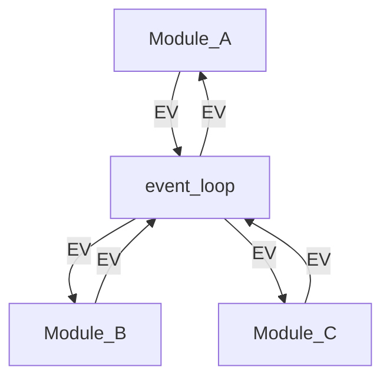

# EventShareOS

EventShareOS is an event driven cooperative operating system for embedded devices or single threaded applications written in straight forward C code.

## Features
* Event Driven
* Soft Timers
* Clean Interfaces for Modules
* Block Data transfers between Modules
* Portability 
* Event Injection for Testing
* ~~Unit Testing of OS Functions~~
* ~~Constant Integration Testing~~
* EventShareOS Versioning
* Application Versioning
* ~~Performance Monitoring~~
* ~~Serial Connectivity~~ 
* ~~Network Connectivity~~
* ~~Serial and Network Protocol~~

~~Strikethrough~~ features are not implemented at this time.

## EventShareOS Design Overview

EventSharedOS is an organizational structure allowing similar functionality grouped into modules. Much like a thread or process in a RTOS, a module is system sub-function.

The passing of data between modules is through events. An event is captured as a pair called E,V unit. A Value is passed with the event. The value is an unsigned 32 bit number. Based on the event type, it's easy to overload the 4 bytes into other types. E stands for Event. V stands for value.

Modules are passive, meaning they are only executed if a subscribed event is available. 

## Implementing EventShareOS
Implementation details and best practices for deploying EvenShare can be found here:

[Implementing EventShareOS](./doc/implementation.md)

## Background and History of EventShareOS
Details on the design philosophy of the creation of EventShareOS.

[EventShareOS History](./doc/background.md)

> **Copyright** 
 EventShareOS is Copyright (c) by Brian L Carver 2026 under a MIT license. See the file: EventShareOS_License.txt for more details. 

[License](./EventShareOS_License.txt)
