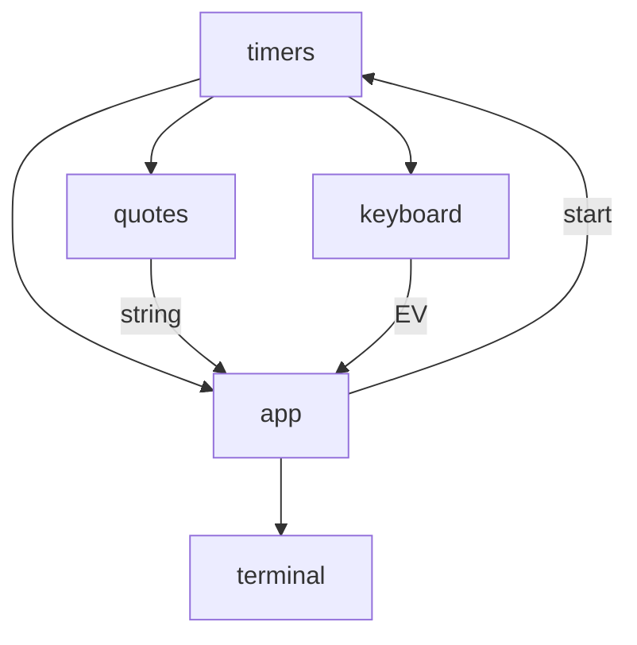

# BASIC EventShareOS Example
This is an example implementation of the Event Share Operating System for POSIX systems. 

The Code is written in C and should compile on most Posix systems.  The original code was written on a Ubantu Linux desktop.  

## BASIC Demo
The code uses two modules, the main module handles soft timer events and keyboard inputs.  The second module reads the keyboard and sends keyboard events. 

There are two special keys used to bring up the menu and quit the program. 


## Program Design

The main program is the application module, or app for short.  The program design is very simple, the keyboard_module reads the keyboard and sends event reads to the application.  

The application processes timer events and keyboards and display them on the terminal. 

Timers are typically repeating, and to demonstrate one shot timers, ever so many repeats of the repeating timer a one shot timer is started. 

To demonstrate data transfers between modules, the quote module will send a data string to the app module with an event.   



## Program Details
There are two important files that are crucial to running the basic EventShareOS example:

1) basic_main.c
2) basic_eventloop.c

### basic_main.c
This is the initialization and main loop of the program.  The first part of the code sets the limits of the events and modules. The second part is the super-loop runs two main functions: timers and the event scheduler. 

basic_main was design for a Linix Posix system.  The timer is handled as a polling operation checking the clock. It runs on microsecond time to provide millisecond soft timers. 

### basic_eventloop.c
This is the heart of implementing any program to EvenLoopOS. There are three main functions that have to be filled out by the programming team:

1) custom_loop_init
2) custom_loop_scheduler
3) custom_loop_quit

These function are defined in custom_event_loop.h.  

#### custom_loop_init
The init function has three sections. In the first section modules subscribe to the various events defined as a  enumeration in events.h file.  

```c
    subscribe(MODULE_KEYBOARD, 1, EVENT_TIMER_KEYBOARD_POLLING );
    subscribe(MODULE_APP,      4, EVENT_KEYBOARD,
                                  EVENT_NEW_QUOTE,
                                  EVENT_TIMER_APP_DEMO,
                                  EVENT_TIMER_ONE_SHOT_DEMO );
    subscribe(MODULE_QUOTE,    1, EVENT_TIMER_APP_DEMO); 
```
The second section covers the soft timers. 
```c
  add_timer_event(EVENT_TIMER_APP_DEMO, 10000,  TIMER_REPEAT, TIMER_ENABLED);
    add_timer_event(EVENT_TIMER_KEYBOARD_POLLING, 100,  TIMER_REPEAT, TIMER_ENABLED);
    add_timer_event(EVENT_TIMER_ONE_SHOT_DEMO, 5000, TIMER_ONE_SHOT, TIMER_DISABLED);
  
```

The third section is the initialization code for the various modules.

```c
    app_module_init();
    keyboard_module_init();
    quote_module_init();
```

#### custom_loop_scheduler
The custom_loop_scheduler takes a module list as a bit mask then runs the correct module.  It's important that the module enumeration matches the position in the module position. 

```c
    if (module_list & MODULE_01_MASK) {
        // call module 01 here
        keyboard_module_control(event, value);
    }
```
Since the keyboard is the most time critical module it is placed first. 

#### custom_loop_quit
When a quit signal is detected all the closing functions are called by EventShareOS.  This is much like a destructor function for a C++ class.  In this example, the quote module prints out a goodbye quote.

```c
void custom_loop_quit(void) {
    app_module_cleanup();
    keyboard_module_cleanup();
    quote_module_cleanup();
}
```
"Every new beginning comes from some other beginning’s end. - Seneca"

> **Copyright** <p> EventShareOS is Copyright (c) by Brian L Carver 2026 under a MIT license. See the file: EventShareOS_License.txt for more details. 

[License](../EventShareOS_License.txt)

