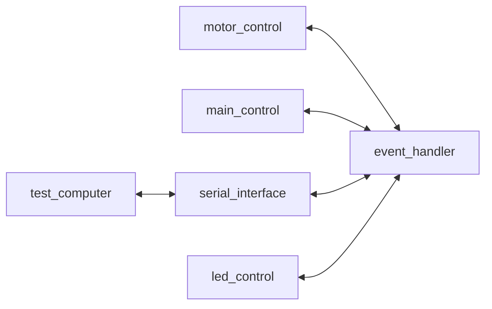
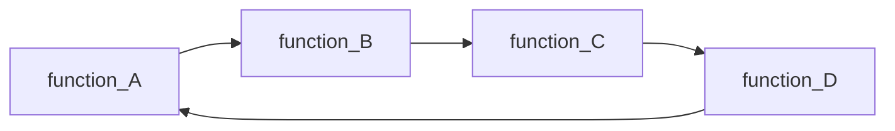
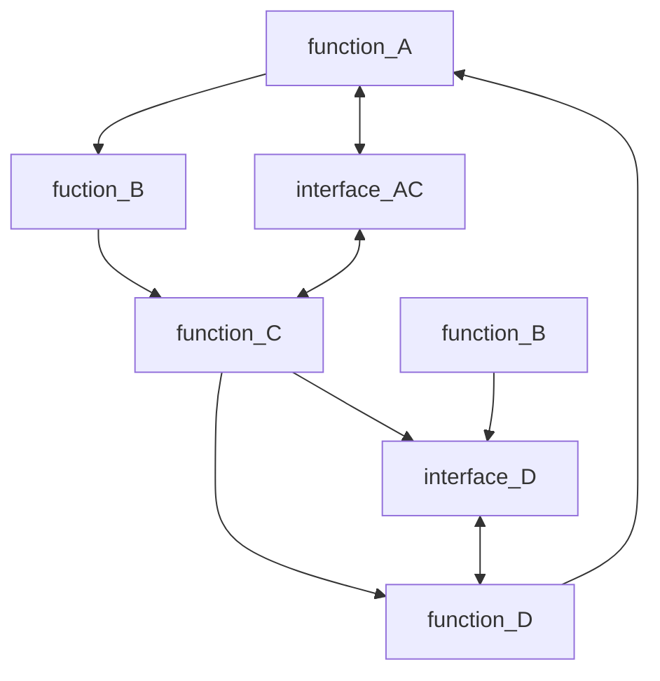
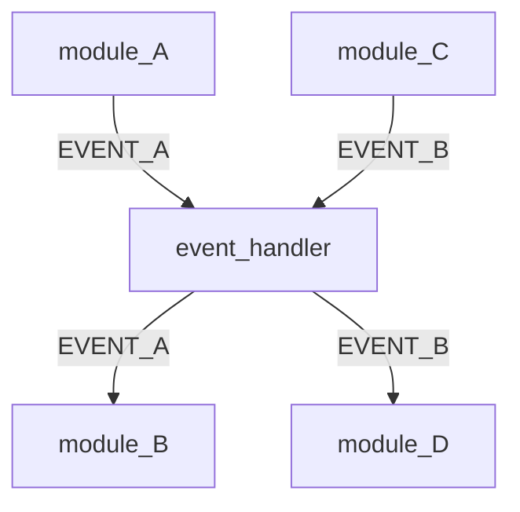

# History and Background of EventShareOS

Years ago I was tasked for writing firmware for motor driven tool. My only interface was a trigger and a LED. I had to monitor tool temperatures, motor speed, current draw, and voltage. As a formal test engineer, I wondered how in the heck I could test this tool with such a limited interface. 

I had written GUI applications on desktops and was very familiar with event driven systems. I wondered if I could use an event driven design on an embedded system. 

I played around with the concept on a linux machine and developed an earlier version of this very concept. I did successfully implemented it on the motor driven tool and built a Windows desktop app to read and write values to the tool. Sadly the tool was never released. 

## Testing
It was testing that drove me to write EventShareOS for such a limited tool.  If I could read and write data to the tool through a serial interface, why not turn that same data into events and *share* the events around the different functions in the tool. 

## Superloops
I have worked with Real Time Operating Systems (RTOS) in the past. RTOS have been used for decades for embedded systems because of their deterministic nature.  It is their ability to guarantee that a task will run a given time is their attraction.  However their usages come with several disadvantages of higher complexity and race-conditions.  It is debugging race conditions that have given firmware engineers heartburn and many sleepless nights.  Simply put they are not easy to debug. 

The alternative to RTOS is the superloop.  It’s where one master loop controls all the various sub-sections of a design.  The biggest issues with superloop programming is they are home grown, typically led to spaghetti code, and finally have no performance monitoring. Since all the code is executed sequentially there are no race conditions.   

## Modules not Functions
Most superloop programming consisted of several functions executed in sequence. 

The main problem with this style of programming is sharing data between the functions in a consistent and controlled manner.  Typically what happens, the programmer will write sub-functions to pass information and spaghetti code is born. 
 

I am sure that above diagram is already causing headaches and swearing. For years I programmed in these very systems, working for hours to chase down bugs in these complex systems.

### Introducing Modules
Ideally any design is broken into a grouping of related requirements. Requirements become functions in the code and module is a great name for a grouping of associated functions. 

In EventShareOS modules do NOT directly share any information with any other module. Data is shared by events. The system handles all the events and sends events around by a module subscription to those events. 

Using the above example and changing the word function to module and using events. This is a much easier design to understand. 

### Cooperative Operating Systems
RTOS are hardcore at preempting functions. This is known as multi-threaded system. Each thread is a grouping of functions.  Once the time is up, that thread is suspended and the next thread is executed. Superloops depend on each function to return control and execution is passed onto the next function. 

EventShareOS is called a cooperative operating system. Each module is given an event, the module must do something with that even and return control back to the operating system. Some modules can execute quickly and others might take longer. 

## New Features
The first iterations of the EventShareOS had a different name and written for a commercial application.  As with most things, you learn with experience. I wanted EventShareOS to be more  agnostic with new features.  

### Block Data Sharing
Events consisted of a pair of unsigned integers: Event and Value. E and V were shared around between the different functions. This was great at passing around data but to send information bigger than a 32 bit unsigned integer was a pain. I had to write functions to send performance data directly to the serial port. This broke the basic design philosophy. 

EventShareOS has large block data sharing. Large chunks can be sent between modules with an associated event number. 

### ~~Version Control~~
*Not Implemented*

EventShareOS will be under version control and build control.  Since this an integrated system, application version and build will be under the same grouping of functions. This is to ease the burden of versioning for implementations and control. 

### ~~Performance Monitoring~~
*Not Implemented*

One big advantage of RTOS is their deterministic nature for an alloted time for each thread.  Because Superloop designs depending on each function (module) returning control, some functions might take more time than others.

For performance tuning it's important to know how much time is executed in a operating system (overhead), each application thread, and any bottle necks on queues and data sharing. EventShareOS will have one global performance monitoring system. 

Performance Data will consists of:
- Module Time
- OS Overhead Time
- Event Queue Misses 
- Data Share Misses

Performance data can be monitored as static variable in the debugger or sent out to a external system over the serial port or network.

### ~~Serial Port~~
*Not Implemented*

In pervious implementations, serial data was a separate module. In future versions of EventShareOS a serial port will be standardized for access.  The systems programmer will decide which events can be shared to the serial port and which events can be blocked from being received by the serial port. 

### ~~Network TCP/IP~~
*Not Implemented*

Network connectivity is a huge desire in the world of The Internet of Things (IOT). EventShareOS will support sending and receiving of data through a TCP/IP connection in the same manner as the serial port. 

Network connectivity will support implementation specific protocols by supplying a port number, transfer number, and the data bytes to the Network sub-system. 

### ~~Serial and Network Protocol~~
*Not Implemented*

The serial port and any network connectivity will share the same protocol for sending events, large data blocks, and implementation specific protocols. By standardizing the same protocol between the serial port the same parser can be used. 

[Back to Readme](../README.adoc)

> **Copyright** 
 EventShareOS is Copyright (c) by Brian L Carver 2026 under a MIT license. See the file: EventShareOS_License.txt for more details. 

[License](../EventShareOS_License.txt)